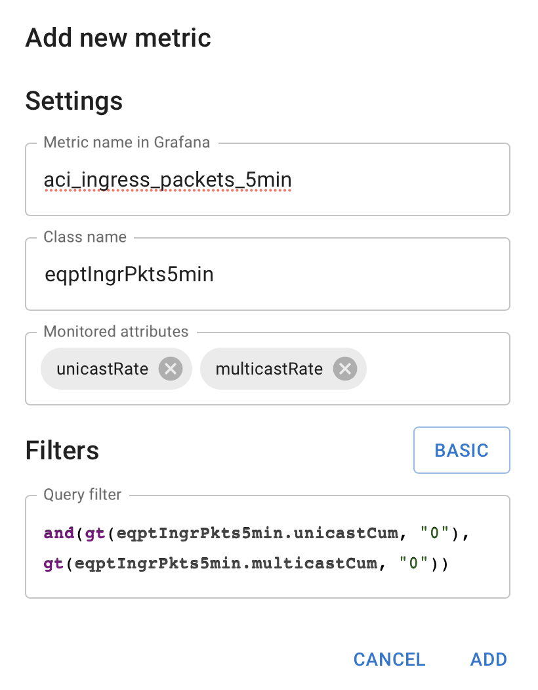
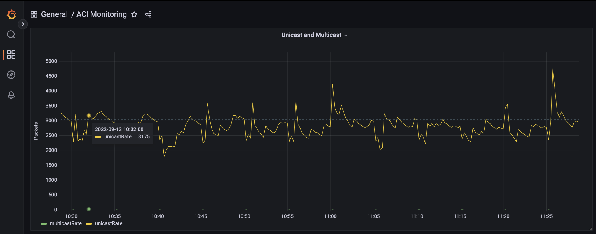

# aci-monitoring

**ACI Moniring Service** is an application that, using the REST API, allows to
fetch any information from the Cisco Application Centric Infrastructure (ACI)
controller. The collected information will then be saved in the
[Prometheus](https://prometheus.io) database and then it will be possible to
visualize it using the [Grafana](https://grafana.com) tool. This application
complements the monitoring functionality available through the APIC GUI, as
the data available there has short retention periods.

- [aci-monitoring](#aci-monitoring)
  - [Why Cisco ACI?](#why-cisco-aci)
  - [Architecture](#architecture)
    - [Components](#components)
    - [Tooling](#tooling)
    - [Code quality](#code-quality)
  - [Quickstart](#quickstart)
  - [Dependencies](#dependencies)
  - [Configure metrics](#configure-metrics)
    - [Example ACI Classes](#example-aci-classes)
    - [Configure Grafana](#configure-grafana)
  - [Development status](#development-status)
  - [Contributing](#contributing)
  - [License](#license)

## Why Cisco ACI?

[Cisco
ACI](https://www.cisco.com/c/en/us/solutions/data-center-virtualization/application-centric-infrastructure/index.html)
is a modern solution that provides an efficient and scalable communication
infrastructure for Data Center. Features such as efficient transport for
applications, nonblocking architecture, and easy scaling from a performance
perspective are not all features of ACI. ACI is also primarily an **SDN**
(*Software Defined Network*) environment. Therefore, a feature as important as
those presented above is the ability to fully manage ACI using [programming
tools](https://developer.cisco.com/docs/aci/#!getting-started) and
[APIs](https://developer.cisco.com/docs/aci/). This is a possibility that is
currently little used and gives great opportunities for integration,
automation (via tools like
[Ansible](https://developer.cisco.com/docs/aci/#!ansible) and
[Terraform](https://developer.cisco.com/learning/modules/terraform-aci-intro/)),
and building on the use of ACI as the foundation of the entire ecosystem of
mutually cooperating components of the Data Center.

In the ACI controller and directly from the devices, we also have classical
methods used for network monitoring, such as
[SNMP](https://www.cisco.com/c/dam/en/us/solutions/collateral/data-center-virtualization/application-centric-infrastructure/aci-guide-configuring-snmp.pdf)
and Syslog. However, they only allow access to part of the information in
relation to the API, which allows access to all objects from over [16k+
classes](https://developer.cisco.com/site/apic-mim-ref-api/) of the object
model. In addition, through SNMP we do not have access to such information as
the application model or parameters of communication applications, because as
such they are not available from typical network devices, in which MIBs for
SNMP were used from.

Access to data via API greatly facilitates access to information, as there is
no need to use, for example, classical and unreliable methods of parsing the
results of commands. The model of data access via the
[REST](https://restfulapi.net) protocol includes one more important feature,
it allows some data processing to be transferred to the server side. This is
the same approach as we have in a typical database engine, where the SQL query
contains [filters and
aggregators](https://www.cisco.com/c/en/us/td/docs/dcn/aci/apic/all/apic-rest-api-configuration-guide/cisco-apic-rest-api-configuration-guide-42x-and-later/m_using_the_rest_api.html),
which are performed on the server side on local data, significantly improving
the search speed and reducing the amount of information needed to be sent.

## Architecture

The architecture of this application had a few things in mind:

* Poll data from ACI
  * It could subscribe to changes as well, but the poller is more stable
  * Polling should be efficient enough to get all information from ACI controllers
* Transfer data to Prometheus and Grafana
  * Both tools are perfect to use that kind of data
  * Data can be modified using the extensive aggregation language and
    Prometheus filters
* Use as small resources as its possible
  * Both in the matter of memory and CPU usage
* GUI should allow easily add new monitored properties
  * It needs an interface to add complex filters in a simple way
  * Possibility to monitor any object and attribute from the ACI object model 

The entire architecture has been designed in a microservice model to
facilitate software maintenance and development. The structure of the
application components and their dependencies are presented in the figure
below:


### Components

* **Data Poller** - a component written in Python that connects to the APIC
  controller, logs in and uses a REST query to retrieve data about the objects
  specified in the configuration. This script also starts the HTTP server and
  uses it to provide the retrieved value in the form of the Prometheus metric.

* **Configuration API** - Component that provides API for configuration
  management of a list of ACI monitoring classes. This configuration is stored
  in the Redis database. This API is used by the GUI for configuration
  management.

* **Configuration GUI** - Simple GUI for creation and deletion of monitoring
  metrics.

* **Prometheus** - database optimized to store data in the form of
  time-series. Its configuration specifies the access data to the server, to
  which it will periodically (by default every 15s) send a query for the
  current value of all available metrics. The collected data is stored in an
  internal data format and a complex language is available to specify the
  possible operations on it.

* **Grafana** - is a popular tool for visualizing various types of data, which
  can be downloaded from various backends, including Prometheus.

### Tooling

The tooling has been selected carefully to decide what would match the best
expectations.

| Component | Solution | Description | Alternative solution |
|-----------|----------|-------------|----------------------|
| **GUI** | React with MUI | Powerful framework, yet simple to work with. Its simple to add even complex display logic. | Any modern framework could work fine. |
| **Database** | Redis | There is only small amount of data that needs to be stored. Redis has very small requirements, yet suits the expectations. | Any database could be used, although in the future Redis has one great capability that it has built in pub/sub, so the application may subscribe to the changes easily. |
| **Dashboard & Monitoring** | Prometheus and Grafana | Common tool for that purpose. | If Prometheus would not be needed, InfluxDB with Grafana could be a better choice. |

### Code quality

To ensure better code quality, there is set up CI/CD to:

* run unit tests
* run Python linter
* ensure common code formatting
* ensure types safety
* audit security of 3rd-party libraries

## Quickstart

It is possible to run and test the operation of the application using the
[Cisco APIC Simulator
Sandbox](https://devnetsandbox.cisco.com/RM/Diagram/Index/4eaa9878-3e74-4105-b26a-bd83eeaa6cd9?diagramType=Topology).
It is a simulated infrastructure that provides full access to ACI RESTful APIs
over `http(s)` with XML and JSON encodings. For ACI production infrastructure,
it is strongly recommended to create a dedicated user with RO permissions
only.

To get _aci-monitoring_ up and running on `Linux` or `macOS` system run the
following commands.

```bash
git clone -b main https://github.com/SoftFlowTech/aci-monitoring.git
cd aci-monitoring
tee local.env <<EOF
ACI_URL=https://apic-ip-address
ACI_USERNAME=aciROuser
ACI_PASSWORD=aciROuserPass
EOF
docker compose pull
docker compose up -d
```

The whole application will be available after a few seconds.
Open the URL [`http://localhost:5006`](http://localhost:5006) in a web-browser.
You should see the GUI homepage.
In the top-right corner you can add new metrics to monitor.


Grafana is available at [`http://localhost:5001`](http://localhost:5001). The
default credentials are:

* Username: **admin**
* Password: **admin**

Prometheus is available at  Prometheus is also available at
[`http://localhost:5002`](http://localhost:5002) and can be used to write and
test queries about the collected data.

The container images are built and published in
[DockerHub](https://hub.docker.com/orgs/softflow/).

## Dependencies

This project relies only on _Docker_ and _docker-compose_ meeting these requirements:

* The _Docker version_ must be at least `20.10.10`.
* The _docker-compose version_ must be at least `1.28.0`.

To check the version installed on your system run `docker --version` and
`docker-compose --version`.

## Configure metrics

To add new metrics, you should visit [Configuration
GUI](http://localhost:5006), and click "**Add new**" button.

There will appear simple form, where you may set:

* **Metric name:** for Prometheus/Grafana
* **Class name:** ACI MO class name that should be monitored
* **Attributes (one or many):** list of attributes that should be monitored in
  this class
* **Query Filter:** list of filters, to select only the MOs that are expected

Example configuration:


Alternatively, you may use "Advanced" button, to provide raw ACI query filter:



### Example ACI Classes

Below is a list of useful Cisco ACI classes to select from.

| Class | Description |
|-------|-------------|
| `eqptEgrBytes5min` | current Egress Bytes stats in 5 minute |
| `eqptEgrDropPkts5min` | current Egress Drop Packets stats in 5 minute |
| `eqptEgrPkts5min` | current Egress Packets stats in 5 minute |
| `eqptFan` | Equipment Fan |
| `eqptFanStats` | current fan stats |
| `eqptFanStats5min` | current fan stats in 5 minute |
| `eqptFruPower5min` | current FRU power stats in 5 minute |
| `eqptIngrBytes5min` | current Ingress Bytes stats in 5 minute |
| `eqptIngrDropPkts5min` | current Ingress Drop Packets stats in 5 minute |
| `eqptIngrErrPkts5min` | current Ingress Error Packets stats in 5 minute |
| `eqptIngrPkts5min` | current Ingress Packets stats in 5 minute |
| `eqptPsPower5min` | current power supply stats in 5 minute |
| `eqptPsu` | Power Supply Unit |
| `eqptPsuSlot` | Power Supply Slot |
| `eqptTemp5min` | current temperature stats in 5 minute |
| `ethpmDOMStats` | Digital Optical Monitor, Transceiver details |
| `ethpmPhysIf` | Physical Interface Runtime State (ethpm) |
| `fabricNodeHealth5min` | current node health stats in 5 minute |
| `fabricOverallHealth5min` | current overall fabric health stats in 5 minute |
| `fvOverallHealth15min` | current overall tenant health stats in 15 minute |
| `l1PhysIf` | Layer 1 Physical Interface Configuration |
| `licenseManager` | License Manager |
| `procSysCPU5min` | current System cpu stats in 5 minute |

### Configure Grafana

You can use any data visualization method available in Grafana. Data obtained
from Prometheus can be aggregated and statistical operations can be performed
on them. Sample chart:



## Development status

`aci-monitoring` is beta software, but it has already been used in production,
and it has an extensive test suite.

## Contributing

Help in testing, development, documentation and other tasks is highly
appreciated and useful to the project.

## License

Copyright 2022 (c) SoftFlow.

Licensed under the Apache License, Version 2.0 (the "License"); you may not
use this file except in compliance with the License.
You may obtain a copy of the License at:

http://www.apache.org/licenses/LICENSE-2.0

Unless required by applicable law or agreed to in writing, software
distributed under the License is distributed on an "AS IS" BASIS, WITHOUT
WARRANTIES OR CONDITIONS OF ANY KIND, either express or implied.  See the
License for the specific language governing permissions and limitations under
the License.
